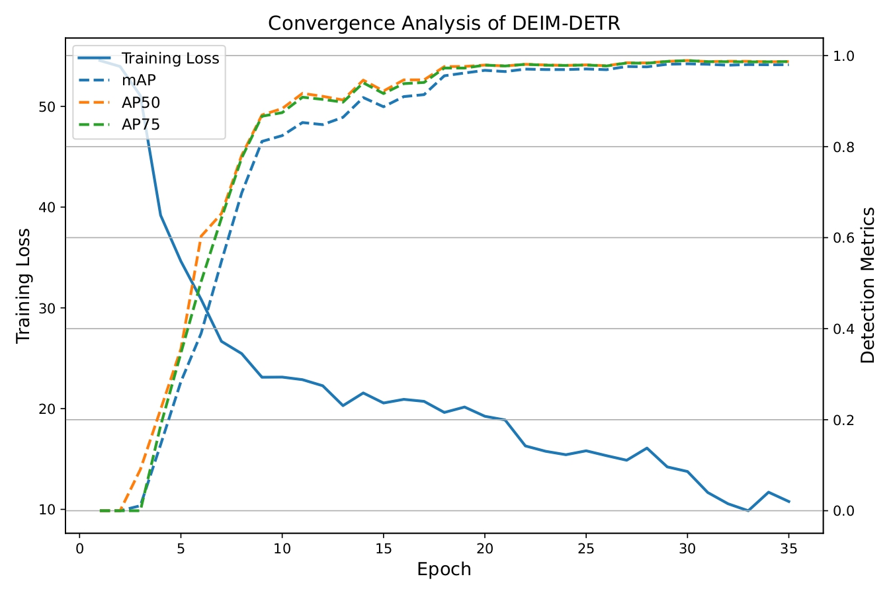
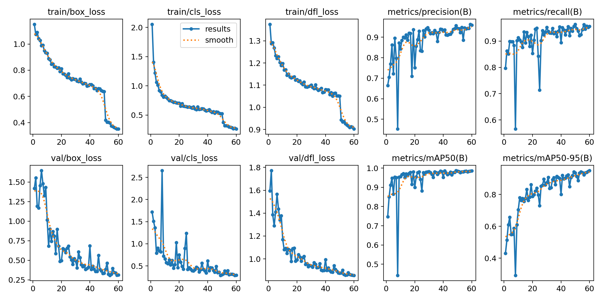

# citrus-leaf-disease-detection
Deep learning-based differentiation of HLB and zinc deficiency in citrus leaves (Sylhet dataset)

## Introduction

Citrus production in Sylhet, Bangladesh is affected by both Huanglongbing (HLB) and zinc deficiency. These two conditions often exhibit visually similar symptoms on leaves, making manual diagnosis difficult for farmers. Misidentification can lead to incorrect treatment decisions and reduced crop yield.

## Objectives 
- to automatically differentiate citrus leaves into Healthy, HLB, and Zinc Deficiency categories using field-collected data.
- to benchmark a recent transformer-based detector (DEIM D-FINE DETRn) against YOLOv8n.

---

## Problem Statement

Huanglongbing (HLB) and zinc deficiency show similar visual characteristics such as leaf chlorosis and mottling, which makes them difficult to distinguish, especially without expert knowledge.

As a result:
- Farmers often confuse HLB with zinc deficiency  
- Incorrect diagnosis leads to improper treatment  
- This increases economic loss and affects citrus production  

The main objective of this project is to develop an automated system that can accurately differentiate between HLB and zinc deficiency in citrus leaves.

## Dataset

The dataset consists of **2954 citrus leaf images** collected from five different gardens in Sylhet, Bangladesh during 2025.

### Data Split
- Training: 2097 images (**70%**)  
- Validation: 591 images (**20%**)  
- Testing: 296 images (**10%**)  

### Classes
- Zinc Deficient  
- Huanglongbing (HLB)
- Healthy
  

---

## Data Collection

Data were collected under real field conditions using a DSLR camera during daytime with natural lighting. Images were captured at an approximate distance of **20 cm** from the leaves.

To ensure consistency and reduce background noise:
- Leaves were placed on a **uniform white board background**  
- Each image contained **3 to 5 leaves per frame**, depending on leaf size  

This multi-leaf acquisition strategy significantly improved data collection efficiency by reducing time and cost compared to capturing single leaves per image.

---

## Preprocessing Pipeline

A multi-stage preprocessing pipeline was developed to convert raw images into model-ready samples:

### Pipeline Overview

Raw Image (multiple leaves)  
→ Background Removal  
→ Leaf Separation  
→ Aspect Ratio Preservation
→ Augmentation
→ Final Dataset  

---

### Background Removal

Background removal was performed using a color-based segmentation approach in HSV color space. A broad color range was used to detect and remove background regions, followed by morphological operations (closing, opening, erosion, dilation) to refine the leaf mask and eliminate noise.

---

### Leaf Separation

After background removal, individual leaves were extracted using contour detection:

- Contours were identified and sorted based on area  
- Each leaf was cropped using bounding boxes with padding  
- Noise and small artifacts were removed using area thresholding  

---

### Aspect Ratio Preservation

Each extracted leaf was resized (4000x4000) while preserving its original aspect ratio. The processed leaf was then placed onto a fixed-size canvas to ensure uniform input dimensions for model training.

---

### Data Augmentation

To address the limited variation in leaf orientation within the dataset, a rotation-based augmentation strategy was applied. Since most leaves were captured in a nearly aligned position, approximately **25% of the images were randomly rotated** to introduce orientation diversity.

This helped the model learn rotation-invariant features and improved robustness to variations in leaf positioning.

### Annotation

All processed images were annotated using **LabelImg** in YOLO format, where each image contains bounding box annotations corresponding to the target classes.

## Training
Yolov8n: epochs= 60 (best=60, img_size = 640, parameters= 3m
DEIM-Dfine-DETRn: epochs= 35 (best=29), img_size= 640, pamameters = 3.7m

## Result and Discussion
Even with only 29 training epochs, the DEIM D-FINE DETR model outperformed YOLOv8n, achieving mAP@50 = 0.989 and mAP@50–95 = 0.982, compared to 0.987 and 0.95 respectively for YOLOv8n. This indicates significantly faster convergence and better generalization. The improved performance can be attributed to the transformer’s global attention mechanism, which captures subtle spatial patterns between visually similar classes such as HLB and zinc deficiency. Additionally, the DEIM framework accelerates training by introducing a dense one-to-one matching strategy and a matchability-aware loss, increasing effective supervision and improving optimization efficiency. These results highlight the advantage of modern DETR variants for fine-grained agricultural disease detection.

### Convergence Comparison

**DEIM D-FINE DETR**

**YOLOv8n**

